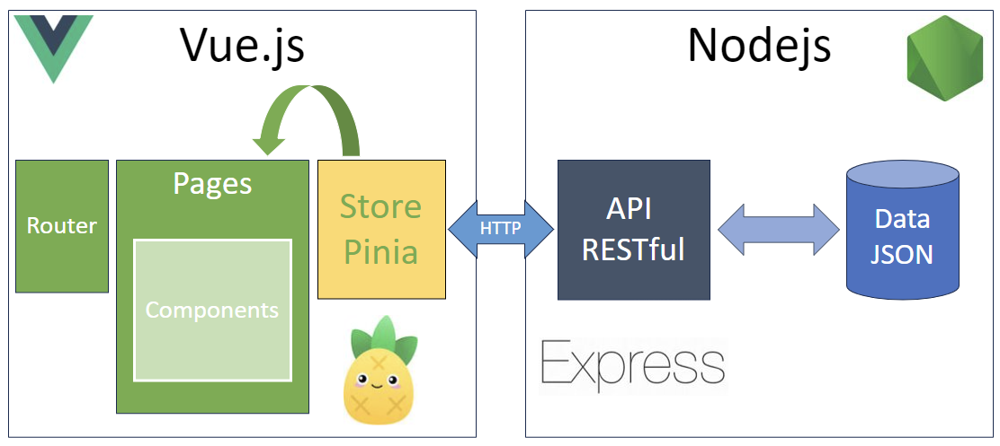

## Description du projet et fonctionnalités implémentées

Notre application permet à n'importe qui de calculer simplement le nombre total de calories dans une recette.

Pour ce faire, il est possible de retranscrire sa recette dans l'application en lui donnant un nom, des étapes et une
liste d'ingédients et leur quantité.

On compte trois pages : une page d'accueil qui affiche la liste complète des recettes, une page de détail de chaque
recette ainsi qu'un formulaire de création.
Sur la page d'accueil, il est possible de supprimer ou bien de modifier une recette.

## Fonctionnalités

Les appels à l’API se font en HTTP sur un serveur Node.js (Express).

La liste des endpoints publics :

- /api/recipes

  modèle de réponse :

  ```JSON
  [
  {
    "id": "273c27e1-613b-4db7-99a9-29f082c829f1",
    "name": "Chocolate Chip Cookies",
    "steps": "Steps of the recipe",
    "ingredients": [
      {
        "id": "c3ae04b4-3c9e-4744-90b0-f0d65dbd8e4f",
        "quantity": 226
      },
      {
        "id": "63fb8432-30a4-4b23-8454-45738d5e3f1e",
        "quantity": 200
      },
      {
        "id": "25f9c3a4-dc37-40b7-af2b-6bcbb77496ae",
        "quantity": 200
      }
    ]
  },
  {
    "id": "7e3b2d0d-6073-4e8e-876a-248c437b0802",
    "name": "Spaghetti Bolognese",
    "steps": "Steps of the recipe",
    "ingredients": [
      {
        "id": "15601312-0503-4d24-bb3c-b62b36c70c9f",
        "quantity": 30
      },
      {
        "id": "c8e6c190-d92e-4c08-a3c3-c9efcd6df2f6",
        "quantity": 200
      },
      {
        "id": "dca546f2-833a-4a48-987a-5733b1aeb0a1",
        "quantity": 120
      },
      {
        "id": "273c27e1-613b-4db7-99a9-29f082c829f1",
        "quantity": 1
      }
    ]
  }
  ]
  ```
- /api/recipes/{id}

  modèle de réponse :

  ```JSON
  {
    "id": "273c27e1-613b-4db7-99a9-29f082c829f1",
    "name": "Chocolate Chip Cookies",
    "steps": "Steps of the recipe",
    "ingredients": [
      {
        "id": "c3ae04b4-3c9e-4744-90b0-f0d65dbd8e4f",
        "quantity": 226
      },
      {
        "id": "63fb8432-30a4-4b23-8454-45738d5e3f1e",
        "quantity": 200
      },
      {
        "id": "25f9c3a4-dc37-40b7-af2b-6bcbb77496ae",
        "quantity": 200
      }
    ]
  }
  ```
- /api/ingredients

  modèle de réponse :

  ```JSON
  [
  {
    "id": "273c27e1-613b-4db7-99a9-29f082c829f1",
    "name": "Salt",
    "unit": "g",
    "caloriesPer100Units": 0
  },
  {
    "id": "7e3b2d0d-6073-4e8e-876a-248c437b0802",
    "name": "Sugar",
    "unit": "g",
    "caloriesPer100Units": 387
  }
  ]
  ```
- /api/ingredients/{id}

  modèle de réponse :

  ```JSON
  {
    "id": "273c27e1-613b-4db7-99a9-29f082c829f1",
    "name": "Salt",
    "unit": "g",
    "caloriesPer100Units": 0
  }
  ```

- /api/recipes/{id}/analyse

  modèle de réponse :

  ```JSON
  2549
  ```

## Installation en local
- Clonez le projet
- Dans les dossiers /back-end et /front-end : npm install ou yarn install puis dans /back-end : npm run start et dans /front-end : quasar dev

## Liste des technos et leur version

- Frontend
    - [Vue.js : 3.0.0](https://vuejs.org/)
    - [Quasar : 2.6.0](https://quasar.dev/)
    - [Pinia : 2.1.4](https://pinia.vuejs.org/)
    - [axios : 1.4.0](https://www.npmjs.com/package/axios)
    - [eslint-webpack-plugin : 4.0.1](https://www.npmjs.com/package/eslint-webpack-plugin)


- Backend
    - [Nodejs : 18.13.0](https://nodejs.org/en)
    - [npm : 9.6.5](https://www.npmjs.com/)
    - [Express : 4.18.2](https://expressjs.com/)
    - [uuid : 9.0.0](https://www.npmjs.com/package/uuid)
    - [nodemon: 2.0.22](https://www.npmjs.com/package/nodemon)

## Architecture technique du projet



## Procédure en cas de bug

Nous avons fait en sorte de renvoyer des erreurs HTTP depuis le serveur (avec des try/catch) et nous avons utilisé la gestion d'erreur d'Axios côté front.

Pour visualiser les erreurs en cas de bug, regarder la console du navigateur.

## Perspective pour l'avenir

Dans le cadre de l'évolution du projet, nous pensions à ajouter plusieurs choses :

- une gestion des ingrédients depuis l'application (formulaire de création, de modification, bouton de suppression)
- une base de données.
- une table utilisateur et la sécurisation des requêtes via token (JWT par exemple)
- des images sur les recettes et les ingrédients